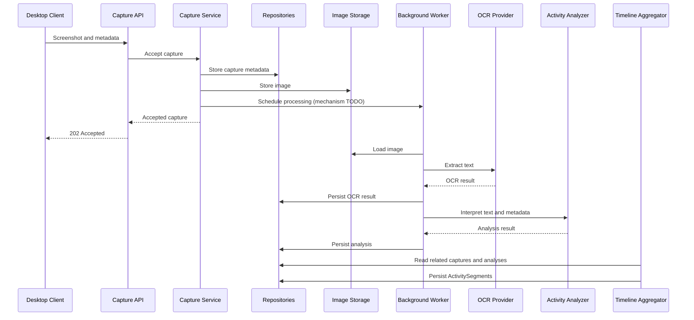

# Architecture

This is the primary source of truth for the MVP architecture. Screcaap is an intentionally small **modular monolith**. Boundaries within one backend process let the team learn, test, and later extract a worker or integration if evidence calls for it.

## Components

| Component | Responsibility |
| --- | --- |
| Desktop Client | Capture screenshots on laptops at a configurable interval (about 30 seconds by default) and submit them with metadata. |
| Capture API | Validate transport requests, call services, and return promptly. |
| Service layer | Orchestrate capture intake, analysis, and timeline use cases. |
| Object/Image Storage | Store and retrieve screenshot bytes behind `ImageStorage`. Local storage is an intended first adapter; hosted storage may come later. |
| Database | Persist metadata and results through repository abstractions. |
| Background Worker | Run capture processing outside the upload request; scheduling and retry technology remain undecided. |
| OCR Provider | Extract text from image pixels only. PP-OCRv5 Mobile is the intended initial adapter. |
| LLM / Activity Analyzer | Interpret OCR text and capture context as apparent activity. OpenRouter is the intended integration. |
| Timeline Aggregator | Eventually merge related captures into `ActivitySegment` periods; behavior patterns use evidence over time. |

## Main processing flow

1. The client captures a screenshot.
2. The client sends the screenshot and metadata to the Capture API.
3. The backend stores capture metadata through a repository.
4. The backend stores the image through `ImageStorage`.
5. The service schedules background processing through a future worker boundary.
6. The API returns `202 Accepted` without waiting for OCR or LLM work.
7. The worker loads the image from storage.
8. OCR extracts text from the image.
9. The OCR result is persisted through a repository.
10. The analyzer interprets OCR text and metadata.
11. The analysis result is persisted through a repository.
12. Timeline processing eventually merges related captures into `ActivitySegment` periods.

The diagram expresses intended responsibilities, not an implemented transaction or queue. Failure handling, ordering, retries, and consistency are TODO design decisions.

## Dependency rules

The dependency direction is **API → Services → Domain / Repository / OCR / LLM / Storage abstractions**. Services own business orchestration. Infrastructure adapters implement interfaces and are wired at a composition boundary. The worker invokes services or application use cases; it does not move business rules into the transport layer.

Forbidden direct dependencies:

- API → PaddleOCR implementation
- API → OpenRouter implementation
- API → ORM operations
- API → filesystem operations

Transport schemas belong in `shared/schemas/`; domain concepts belong in `server/domain/`; persistence models belong in `server/database/models/`. Repositories hide persistence mechanics from services. OCR, analyzer, and image storage adapters sit behind named abstractions.

## Scaling philosophy

Use one deployable backend while the team is small. Do not add microservices, Kafka, Kubernetes, event sourcing, or distributed infrastructure without a demonstrated requirement. Internal event names in [events.md](events.md) describe concepts, not a broker choice. Material changes to these boundaries require an ADR.
